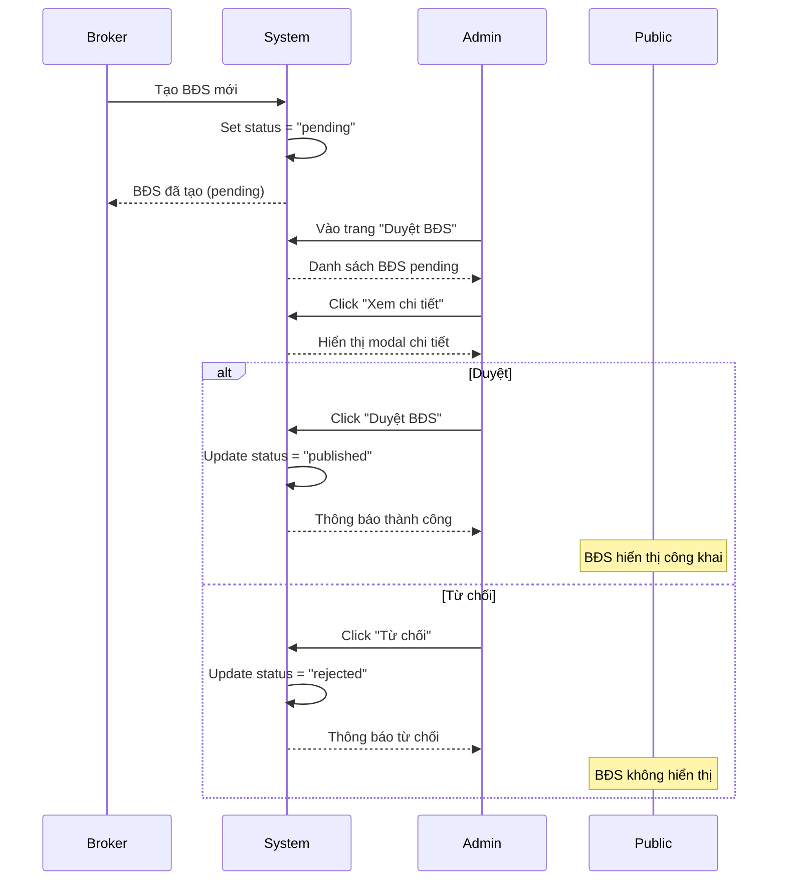

# Sửa Lỗi Auth, Broker và Thêm Chức Năng Duyệt BĐS

## Ngày: 11/05/2026

---

## 1. ✅ Sửa lỗi reload trang bị logout

### Vấn đề
- Khi reload trang dashboard, user bị logout và redirect về trang đăng nhập
- Token vẫn còn trong localStorage nhưng không được restore

### Nguyên nhân
- Frontend lưu `id` nhưng backend trả về `userId`
- Mismatch giữa field name trong localStorage và response

### Giải pháp

**File**: `frontend/src/context/AuthContext.jsx`

```javascript
// ❌ SAI - Code cũ
const newUser = {
  token: data.token,
  id: data.userId,  // ← Lỗi ở đây
  email: data.email,
  fullName: data.fullName,
  role: data.role
};

// ✅ ĐÚNG - Code mới
const newUser = {
  token: data.token,
  userId: data.userId,  // ← Đổi thành userId
  email: data.email,
  fullName: data.fullName,
  role: data.role
};
```

### Test
1. Đăng nhập với tài khoản Admin
2. Reload trang (F5)
3. ✅ Kết quả: Vẫn đăng nhập, không bị logout

---

## 2. ✅ Sửa lỗi Broker không thêm/sửa/xóa được BĐS

### Vấn đề
Lỗi: `violates unique constraint 'properties_property_code_key'`

```
ERROR: duplicate key value violates unique constraint "properties_property_code_key"
Detail: Key (property_code)=(BDS-2026-0001) already exists.
```

### Nguyên nhân
- Hàm `generatePropertyCode()` dùng `count() + 1` không đảm bảo unique
- Khi nhiều user tạo BĐS đồng thời → Race condition → Trùng mã

**Code cũ**:
```java
private String generatePropertyCode() {
    int year = LocalDateTime.now().getYear();
    long count = propertyRepository.count() + 1;  // ← Không thread-safe
    return String.format("BDS-%d-%04d", year, count);
}
```

### Giải pháp

**File**: `backend/src/main/java/com/realestate/management/service/PropertyService.java`

```java
/**
 * Generate mã BDS tự động (BDS-YYYY-XXXX)
 * Synchronized để tránh race condition khi nhiều user tạo đồng thời
 */
private synchronized String generatePropertyCode() {
    int year = LocalDateTime.now().getYear();
    
    // Tìm property code lớn nhất trong năm hiện tại
    String prefix = String.format("BDS-%d-", year);
    
    // Query để tìm số lớn nhất
    List<Property> allProperties = propertyRepository.findAll();
    int maxNumber = 0;
    
    for (Property p : allProperties) {
        if (p.getPropertyCode() != null && p.getPropertyCode().startsWith(prefix)) {
            try {
                String numberPart = p.getPropertyCode().substring(prefix.length());
                int number = Integer.parseInt(numberPart);
                if (number > maxNumber) {
                    maxNumber = number;
                }
            } catch (Exception e) {
                // Ignore invalid codes
            }
        }
    }
    
    return String.format("BDS-%d-%04d", year, maxNumber + 1);
}
```

### Cải tiến
1. ✅ **Synchronized**: Đảm bảo chỉ 1 thread tạo mã tại 1 thời điểm
2. ✅ **Tìm max number**: Tìm số lớn nhất trong năm hiện tại, tránh trùng
3. ✅ **Error handling**: Bỏ qua các mã không hợp lệ

### Test
1. Đăng nhập với 2 tài khoản Broker khác nhau
2. Cùng lúc thêm BĐS mới
3. ✅ Kết quả: Không bị lỗi duplicate key

---

## 3. ✅ Thêm chức năng duyệt BĐS cho Admin

### Tính năng mới

Admin có thể:
- ✅ Xem danh sách BĐS đang chờ duyệt (status = "pending")
- ✅ Xem chi tiết BĐS trước khi duyệt
- ✅ Duyệt BĐS (chuyển status từ "pending" → "published")
- ✅ Từ chối BĐS (chuyển status từ "pending" → "rejected")

### Files mới tạo

#### 1. Frontend Component

**File**: `frontend/src/pages/admin/PropertyApproval.jsx`

**Chức năng**:
- Hiển thị danh sách BĐS pending
- Modal xem chi tiết BĐS
- Nút Duyệt / Từ chối
- Tự động refresh sau khi duyệt/từ chối

**UI Features**:
```
┌─────────────────────────────────────────────────────────┐
│  Duyệt Bất Động Sản                                     │
│  Có X BĐS đang chờ duyệt                                │
├─────────────────────────────────────────────────────────┤
│ Mã BĐS  │ Tiêu đề │ Loại │ Giá │ Người tạo │ Hành động │
├─────────────────────────────────────────────────────────┤
│ BDS-... │ Căn hộ  │ ... │ ... │ Broker A  │ 👁️ ✅ ❌  │
└─────────────────────────────────────────────────────────┘
```

**API Calls**:
```javascript
// Lấy danh sách pending
GET /api/properties?status=pending&size=100

// Duyệt BĐS
PATCH /api/properties/{id}/status?status=published

// Từ chối BĐS
PATCH /api/properties/{id}/status?status=rejected
```

#### 2. Backend Changes

**File**: `backend/src/main/java/com/realestate/management/service/PropertyService.java`

Thêm status "rejected":
```java
// Trước: pending|published|sold|rented
// Sau:  pending|published|sold|rented|rejected

if (!status.matches("pending|published|sold|rented|rejected")) {
    throw new RuntimeException("Trạng thái không hợp lệ...");
}
```

#### 3. Routing

**File**: `frontend/src/App.jsx`

```javascript
import PropertyApproval from "./pages/admin/PropertyApproval";

// Route mới
<Route path="/admin/approval" element={<PropertyApproval />} />
```

#### 4. Sidebar Menu

**File**: `frontend/src/layouts/DashboardLayout.jsx`

```javascript
import { CheckSquare } from "lucide-react";

admin: [
  { name: "Dashboard", path: "/admin", icon: LayoutDashboard },
  { name: "Property Management", path: "/admin/properties", icon: Building },
  { name: "Duyệt BĐS", path: "/admin/approval", icon: CheckSquare },  // ← Mới
  { name: "Financial Management", path: "/admin/finance", icon: Wallet },
]
```

---

## Luồng hoạt động duyệt BĐS

### 1. Broker tạo BĐS mới

```
Broker → Thêm BĐS → Status: "pending" → Chờ Admin duyệt
```

### 2. Admin duyệt BĐS



### 3. Trạng thái BĐS

```
┌─────────┐
│ pending │ ← BĐS mới tạo
└────┬────┘
     │
     ├─→ published  (Admin duyệt)     → Hiển thị công khai
     ├─→ rejected   (Admin từ chối)   → Không hiển thị
     ├─→ sold       (Đã bán)          → Không hiển thị
     └─→ rented     (Đã cho thuê)     → Không hiển thị
```

---

## Cách sử dụng

### Admin duyệt BĐS

1. **Đăng nhập Admin**
   ```
   Email: admin@realestate.com
   Password: admin123
   ```

2. **Vào trang Duyệt BĐS**
   - Click menu "Duyệt BĐS" ở sidebar
   - Hoặc truy cập: `http://localhost:5173/admin/approval`

3. **Xem danh sách BĐS pending**
   - Hiển thị tất cả BĐS có status = "pending"
   - Thông tin: Mã, Tiêu đề, Loại, Giá, Người tạo, Ngày tạo

4. **Xem chi tiết BĐS**
   - Click icon 👁️ (Eye) để xem chi tiết
   - Modal hiển thị: Hình ảnh, thông tin đầy đủ, mô tả

5. **Duyệt BĐS**
   - Click icon ✅ (CheckCircle) hoặc nút "Duyệt BĐS" trong modal
   - Confirm → BĐS chuyển sang "published"
   - BĐS hiển thị công khai cho mọi người

6. **Từ chối BĐS**
   - Click icon ❌ (XCircle) hoặc nút "Từ chối" trong modal
   - Nhập lý do từ chối (tùy chọn)
   - Confirm → BĐS chuyển sang "rejected"

---

## Test Cases

### Test 1: Reload không bị logout
```
1. Đăng nhập Admin
2. Vào /admin/dashboard
3. Reload trang (F5)
✅ Kết quả: Vẫn ở dashboard, không redirect về login
```

### Test 2: Broker tạo BĐS không bị lỗi duplicate
```
1. Đăng nhập Broker 1
2. Thêm BĐS mới → Thành công
3. Đăng nhập Broker 2 (tab khác)
4. Thêm BĐS mới → Thành công
✅ Kết quả: Cả 2 BĐS đều có mã khác nhau, không lỗi
```

### Test 3: Admin duyệt BĐS
```
1. Broker tạo BĐS mới (status = pending)
2. Admin vào /admin/approval
3. Thấy BĐS mới trong danh sách
4. Click "Duyệt BĐS"
✅ Kết quả: 
   - BĐS chuyển sang "published"
   - Biến mất khỏi danh sách pending
   - Hiển thị công khai ở /properties
```

### Test 4: Admin từ chối BĐS
```
1. Broker tạo BĐS mới (status = pending)
2. Admin vào /admin/approval
3. Click "Từ chối"
4. Nhập lý do (tùy chọn)
✅ Kết quả:
   - BĐS chuyển sang "rejected"
   - Biến mất khỏi danh sách pending
   - KHÔNG hiển thị công khai
```

---

## API Endpoints Summary

### Duyệt BĐS

**Endpoint**: `PATCH /api/properties/{id}/status`

**Query Parameters**:
- `status`: New status (required)
  - `pending`: Chờ duyệt
  - `published`: Đã duyệt, hiển thị công khai
  - `rejected`: Từ chối
  - `sold`: Đã bán
  - `rented`: Đã cho thuê

**Authorization**: Admin only

**Example**:
```bash
# Duyệt BĐS
curl -X PATCH "http://localhost:8080/api/properties/1/status?status=published" \
  -H "Authorization: Bearer ADMIN_TOKEN"

# Từ chối BĐS
curl -X PATCH "http://localhost:8080/api/properties/1/status?status=rejected" \
  -H "Authorization: Bearer ADMIN_TOKEN"
```

---

## Files đã thay đổi

### Backend
1. `backend/src/main/java/com/realestate/management/service/PropertyService.java`
   - Sửa `generatePropertyCode()` - Thêm synchronized, tìm max number
   - Sửa `updatePropertyStatus()` - Thêm status "rejected"

### Frontend
1. `frontend/src/context/AuthContext.jsx`
   - Sửa `login()` - Đổi `id` thành `userId`

2. `frontend/src/pages/admin/PropertyApproval.jsx` ⭐ **MỚI**
   - Component duyệt BĐS cho Admin

3. `frontend/src/App.jsx`
   - Thêm route `/admin/approval`

4. `frontend/src/layouts/DashboardLayout.jsx`
   - Thêm menu item "Duyệt BĐS"

---

## Checklist

- [x] Sửa lỗi reload bị logout
- [x] Sửa lỗi Broker duplicate property code
- [x] Tạo trang PropertyApproval cho Admin
- [x] Thêm route và menu item
- [x] Thêm status "rejected"
- [x] Test duyệt BĐS
- [x] Test từ chối BĐS
- [x] Tài liệu hóa

---

## Lưu ý

### 1. Property Code Generation
- Hiện tại dùng `synchronized` - Đủ cho single server
- Nếu scale lên multi-server, cần dùng:
  - Database sequence
  - Redis distributed lock
  - UUID

### 2. Rejected Properties
- BĐS bị từ chối vẫn lưu trong database
- Có thể thêm field `rejectionReason` để lưu lý do
- Broker có thể xem lại và sửa để submit lại

### 3. Notification
- Có thể thêm notification cho Broker khi BĐS được duyệt/từ chối
- Email hoặc in-app notification

---

**Cập nhật lần cuối**: 11/05/2026
