# Tài liệu Luồng Hoạt Động - Hệ Thống Quản Lý Bất Động Sản

## Mục lục
1. [Tổng quan hệ thống](#tổng-quan-hệ-thống)
2. [Luồng đăng ký và đăng nhập](#luồng-đăng-ký-và-đăng-nhập)
3. [Luồng quản lý bất động sản](#luồng-quản-lý-bất-động-sản)
4. [Luồng đặt lịch hẹn xem](#luồng-đặt-lịch-hẹn-xem)
5. [Luồng quản lý giao dịch](#luồng-quản-lý-giao-dịch)
6. [Luồng quản lý khách hàng tiềm năng](#luồng-quản-lý-khách-hàng-tiềm-năng)

---

## Tổng quan hệ thống

### Kiến trúc hệ thống
```
┌─────────────────┐         ┌─────────────────┐         ┌─────────────────┐
│   Frontend      │         │    Backend      │         │    Database     │
│   (React +      │ ◄─────► │   (Spring Boot  │ ◄─────► │   (PostgreSQL)  │
│   Vite)         │  REST   │   + JWT)        │  JPA    │                 │
└─────────────────┘   API   └─────────────────┘         └─────────────────┘
```

### Vai trò người dùng
- **Admin**: Quản trị viên hệ thống - Toàn quyền quản lý
- **Broker**: Môi giới bất động sản - Quản lý BĐS được gán, khách hàng, giao dịch
- **Customer**: Khách hàng - Xem BĐS, đặt lịch hẹn, yêu thích BĐS

---

## Luồng đăng ký và đăng nhập

### 1. Đăng ký tài khoản mới

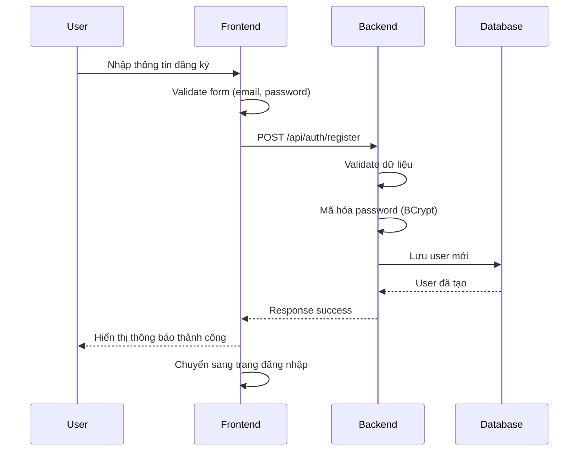
```mermaid
sequenceDiagram
    participant U as User
    participant F as Frontend
    participant B as Backend
    participant DB as Database

    U->>F: Nhập thông tin đăng ký
    F->>F: Validate form (email, password)
    F->>B: POST /api/auth/register
    B->>B: Validate dữ liệu
    B->>B: Mã hóa password (BCrypt)
    B->>DB: Lưu user mới
    DB-->>B: User đã tạo
    B-->>F: Response success
    F-->>U: Hiển thị thông báo thành công
    F->>F: Chuyển sang trang đăng nhập
```

**Endpoint**: `POST /api/auth/register`

**Request Body**:
```json
{
  "email": "user@example.com",
  "password": "password123",
  "fullName": "Nguyễn Văn A",
  "phone": "0123456789",
  "role": "customer"
}
```

**Response**:
```json
{
  "success": true,
  "message": "Đăng ký thành công",
  "data": {
    "userId": 1,
    "email": "user@example.com",
    "fullName": "Nguyễn Văn A",
    "role": "customer"
  }
}
```

### 2. Đăng nhập

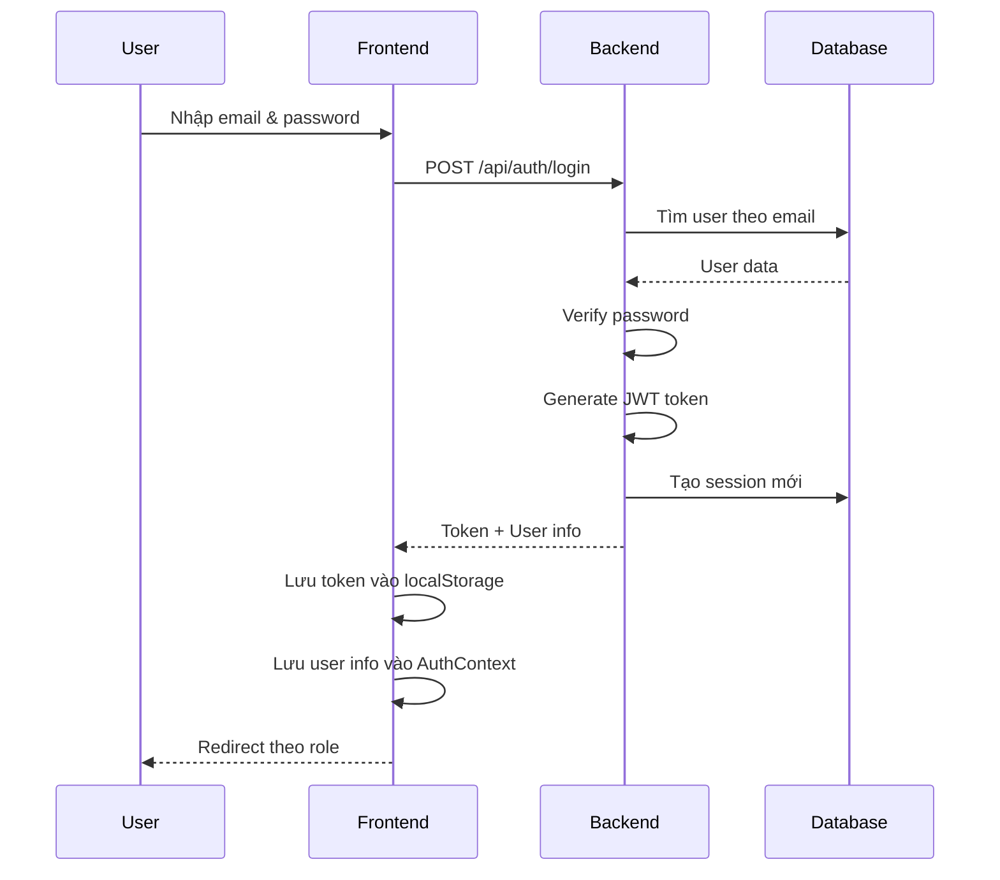
```mermaid
sequenceDiagram
    participant U as User
    participant F as Frontend
    participant B as Backend
    participant DB as Database

    U->>F: Nhập email & password
    F->>B: POST /api/auth/login
    B->>DB: Tìm user theo email
    DB-->>B: User data
    B->>B: Verify password
    B->>B: Generate JWT token
    B->>DB: Tạo session mới
    B-->>F: Token + User info
    F->>F: Lưu token vào localStorage
    F->>F: Lưu user info vào AuthContext
    F-->>U: Redirect theo role
```

**Endpoint**: `POST /api/auth/login`

**Request Body**:
```json
{
  "email": "user@example.com",
  "password": "password123"
}
```

**Response**:
```json
{
  "success": true,
  "message": "Đăng nhập thành công",
  "data": {
    "token": "eyJhbGciOiJIUzI1NiIsInR5cCI6IkpXVCJ9...",
    "user": {
      "userId": 1,
      "email": "user@example.com",
      "fullName": "Nguyễn Văn A",
      "role": "customer"
    }
  }
}
```

**Redirect sau khi đăng nhập**:
- Admin → `/admin/dashboard`
- Broker → `/broker/dashboard`
- Customer → `/customer/dashboard`

---

## Luồng quản lý bất động sản

### 1. Xem danh sách BĐS (Public)

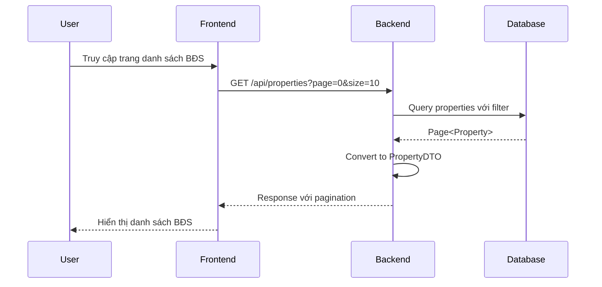
```mermaid
sequenceDiagram
    participant U as User
    participant F as Frontend
    participant B as Backend
    participant DB as Database

    U->>F: Truy cập trang danh sách BĐS
    F->>B: GET /api/properties?page=0&size=10
    B->>DB: Query properties với filter
    DB-->>B: Page<Property>
    B->>B: Convert to PropertyDTO
    B-->>F: Response với pagination
    F-->>U: Hiển thị danh sách BĐS
```

**Endpoint**: `GET /api/properties`

**Query Parameters**:
- `page`: Số trang (default: 0)
- `size`: Số item/trang (default: 10)
- `status`: Trạng thái (published, pending, sold, rented)
- `propertyType`: Loại BĐS (Căn hộ, Nhà riêng, Đất nền, Biệt thự)
- `province`: Tỉnh/Thành phố
- `district`: Quận/Huyện
- `minPrice`, `maxPrice`: Khoảng giá
- `minArea`, `maxArea`: Khoảng diện tích
- `keyword`: Từ khóa tìm kiếm
- `sortBy`: Sắp xếp theo (createdAt, price, area)
- `sortDirection`: Hướng sắp xếp (ASC, DESC)

**Response**:
```json
{
  "success": true,
  "message": "Lấy danh sách BDS thành công",
  "data": {
    "content": [
      {
        "propertyId": 1,
        "propertyCode": "BDS-2026-0001",
        "title": "Căn hộ cao cấp Vinhomes",
        "description": "Căn hộ 3 phòng ngủ...",
        "propertyType": "Căn hộ",
        "status": "published",
        "province": "Hà Nội",
        "district": "Quận Cầu Giấy",
        "area": 120.5,
        "price": 5000000000,
        "images": [
          {
            "imageId": 1,
            "url": "https://...",
            "isPrimary": true
          }
        ],
        "createdBy": {
          "userId": 2,
          "fullName": "Admin User",
          "email": "admin@example.com"
        },
        "assignedTo": {
          "userId": 3,
          "fullName": "Broker User",
          "email": "broker@example.com",
          "phone": "0123456789"
        },
        "createdAt": "2026-05-10T10:00:00"
      }
    ],
    "totalElements": 50,
    "totalPages": 5,
    "size": 10,
    "number": 0
  }
}
```

### 2. Xem chi tiết BĐS

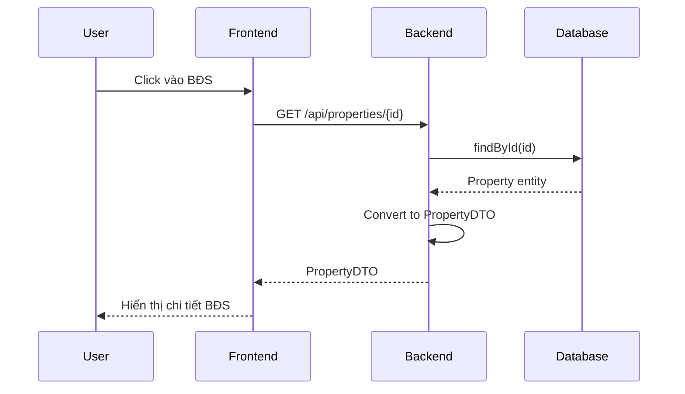
```mermaid
sequenceDiagram
    participant U as User
    participant F as Frontend
    participant B as Backend
    participant DB as Database

    U->>F: Click vào BĐS
    F->>B: GET /api/properties/{id}
    B->>DB: findById(id)
    DB-->>B: Property entity
    B->>B: Convert to PropertyDTO
    B-->>F: PropertyDTO
    F-->>U: Hiển thị chi tiết BĐS
```

**Endpoint**: `GET /api/properties/{id}`

### 3. Thêm BĐS mới (Admin/Broker)

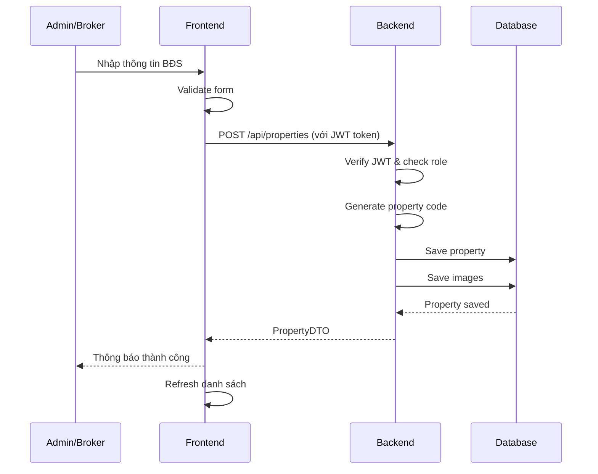
```mermaid
sequenceDiagram
    participant U as Admin/Broker
    participant F as Frontend
    participant B as Backend
    participant DB as Database

    U->>F: Nhập thông tin BĐS
    F->>F: Validate form
    F->>B: POST /api/properties (với JWT token)
    B->>B: Verify JWT & check role
    B->>B: Generate property code
    B->>DB: Save property
    B->>DB: Save images
    DB-->>B: Property saved
    B-->>F: PropertyDTO
    F-->>U: Thông báo thành công
    F->>F: Refresh danh sách
```

**Endpoint**: `POST /api/properties`

**Headers**:
```
Authorization: Bearer {JWT_TOKEN}
```

**Request Body**:
```json
{
  "title": "Căn hộ cao cấp Vinhomes",
  "description": "Căn hộ 3 phòng ngủ, view đẹp...",
  "propertyType": "Căn hộ",
  "province": "Hà Nội",
  "district": "Quận Cầu Giấy",
  "area": 120.5,
  "price": 5000000000,
  "assignedToId": 3,
  "images": [
    {
      "url": "https://example.com/image1.jpg",
      "isPrimary": true
    },
    {
      "url": "https://example.com/image2.jpg",
      "isPrimary": false
    }
  ]
}
```

**Quy trình tạo BĐS**:
1. Hệ thống tự động tạo mã BĐS: `BDS-{YEAR}-{NUMBER}` (VD: BDS-2026-0001)
2. Trạng thái mặc định: `pending`
3. Admin có thể gán broker phụ trách qua `assignedToId`
4. Lưu thông tin người tạo vào `createdBy`

### 4. Cập nhật BĐS (Admin/Broker)

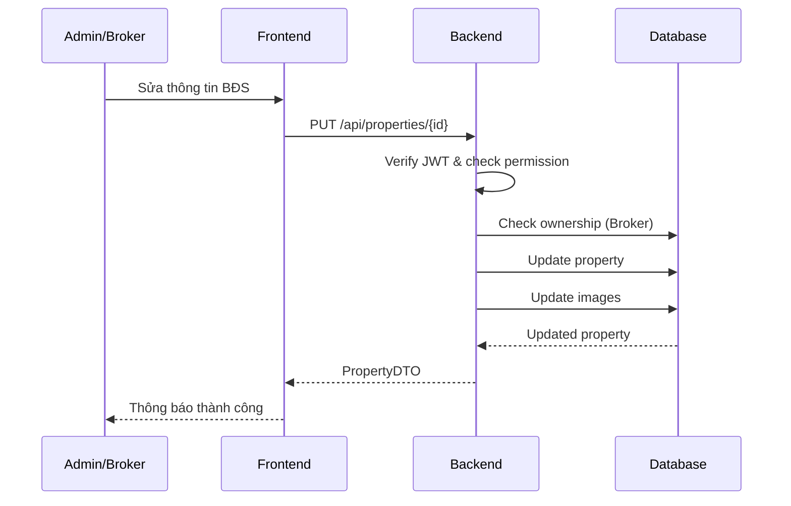
```mermaid
sequenceDiagram
    participant U as Admin/Broker
    participant F as Frontend
    participant B as Backend
    participant DB as Database

    U->>F: Sửa thông tin BĐS
    F->>B: PUT /api/properties/{id}
    B->>B: Verify JWT & check permission
    B->>DB: Check ownership (Broker)
    B->>DB: Update property
    B->>DB: Update images
    DB-->>B: Updated property
    B-->>F: PropertyDTO
    F-->>U: Thông báo thành công
```

**Endpoint**: `PUT /api/properties/{id}`

**Quyền hạn**:
- **Admin**: Có thể sửa tất cả BĐS
- **Broker**: Chỉ sửa được BĐS do mình phụ trách (assignedTo)

### 5. Xóa BĐS (Admin only)

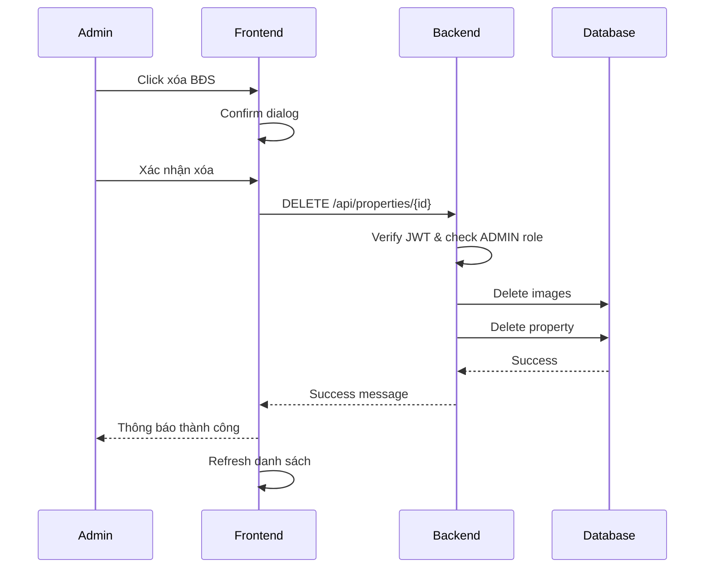
```mermaid
sequenceDiagram
    participant U as Admin
    participant F as Frontend
    participant B as Backend
    participant DB as Database

    U->>F: Click xóa BĐS
    F->>F: Confirm dialog
    U->>F: Xác nhận xóa
    F->>B: DELETE /api/properties/{id}
    B->>B: Verify JWT & check ADMIN role
    B->>DB: Delete images
    B->>DB: Delete property
    DB-->>B: Success
    B-->>F: Success message
    F-->>U: Thông báo thành công
    F->>F: Refresh danh sách
```

**Endpoint**: `DELETE /api/properties/{id}`

**Lưu ý**: Chỉ Admin mới có quyền xóa BĐS

### 6. Cập nhật trạng thái BĐS (Admin only)

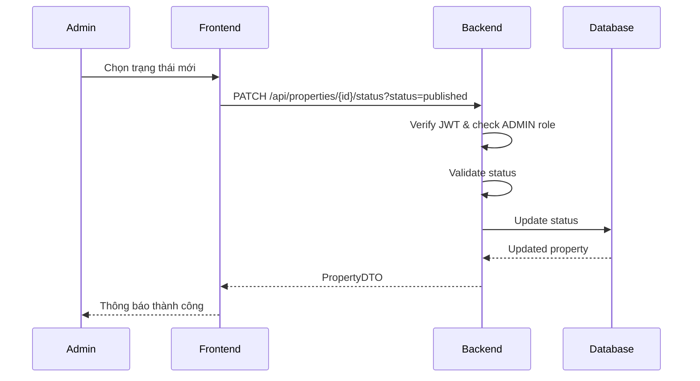
```mermaid
sequenceDiagram
    participant U as Admin
    participant F as Frontend
    participant B as Backend
    participant DB as Database

    U->>F: Chọn trạng thái mới
    F->>B: PATCH /api/properties/{id}/status?status=published
    B->>B: Verify JWT & check ADMIN role
    B->>B: Validate status
    B->>DB: Update status
    DB-->>B: Updated property
    B-->>F: PropertyDTO
    F-->>U: Thông báo thành công
```

**Endpoint**: `PATCH /api/properties/{id}/status`

**Query Parameters**:
- `status`: Trạng thái mới (pending, published, sold, rented)

**Luồng trạng thái**:
```
pending → published → sold/rented
```

---

## Luồng đặt lịch hẹn xem

### 1. Khách hàng đặt lịch hẹn

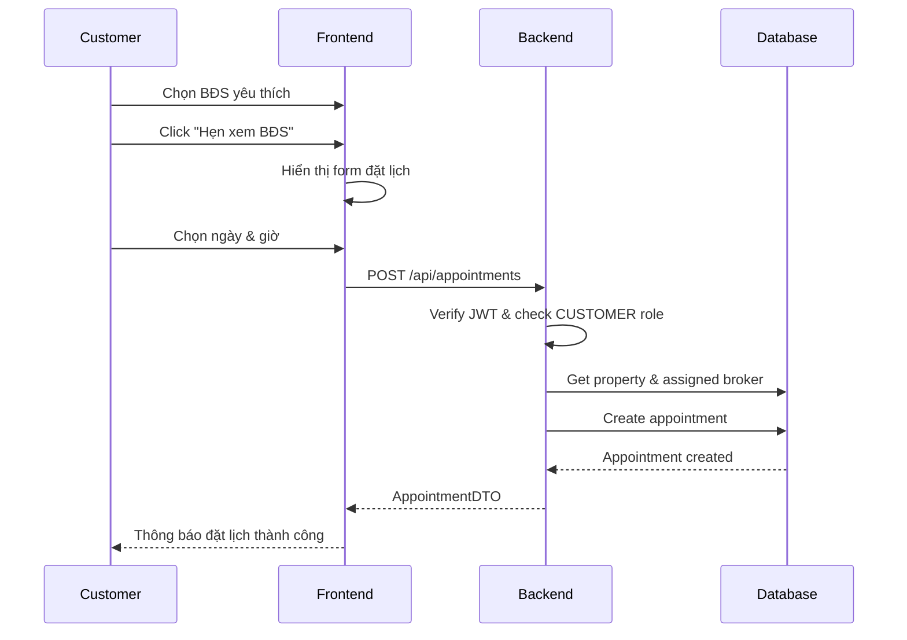
```mermaid
sequenceDiagram
    participant C as Customer
    participant F as Frontend
    participant B as Backend
    participant DB as Database

    C->>F: Chọn BĐS yêu thích
    C->>F: Click "Hẹn xem BĐS"
    F->>F: Hiển thị form đặt lịch
    C->>F: Chọn ngày & giờ
    F->>B: POST /api/appointments
    B->>B: Verify JWT & check CUSTOMER role
    B->>DB: Get property & assigned broker
    B->>DB: Create appointment
    DB-->>B: Appointment created
    B-->>F: AppointmentDTO
    F-->>C: Thông báo đặt lịch thành công
```

**Endpoint**: `POST /api/appointments`

**Headers**:
```
Authorization: Bearer {JWT_TOKEN}
```

**Request Body**:
```json
{
  "propertyId": 1,
  "scheduledAt": "2026-05-15T14:00:00",
  "note": "Khách hàng hẹn xem qua portal"
}
```

**Response**:
```json
{
  "success": true,
  "message": "Đặt lịch thành công",
  "data": {
    "appointmentId": 1,
    "propertyId": 1,
    "propertyTitle": "Căn hộ cao cấp Vinhomes",
    "customerId": 5,
    "customerName": "Nguyễn Văn A",
    "brokerId": 3,
    "brokerName": "Trần Thị B",
    "scheduledAt": "2026-05-15T14:00:00",
    "status": "pending",
    "note": "Khách hàng hẹn xem qua portal"
  }
}
```

**Quy trình**:
1. Hệ thống tự động lấy broker phụ trách BĐS từ `property.assignedTo`
2. Nếu BĐS chưa có broker → Báo lỗi
3. Trạng thái mặc định: `pending`
4. Broker sẽ thấy lịch hẹn trong dashboard của mình

### 2. Xem danh sách lịch hẹn

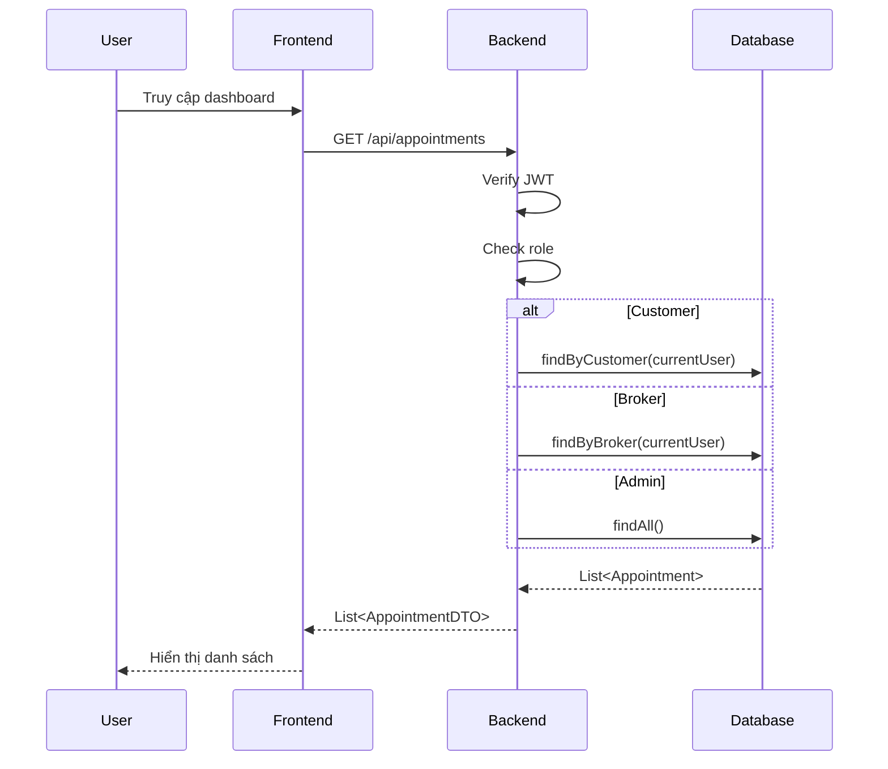
```mermaid
sequenceDiagram
    participant U as User
    participant F as Frontend
    participant B as Backend
    participant DB as Database

    U->>F: Truy cập dashboard
    F->>B: GET /api/appointments
    B->>B: Verify JWT
    B->>B: Check role
    alt Customer
        B->>DB: findByCustomer(currentUser)
    else Broker
        B->>DB: findByBroker(currentUser)
    else Admin
        B->>DB: findAll()
    end
    DB-->>B: List<Appointment>
    B-->>F: List<AppointmentDTO>
    F-->>U: Hiển thị danh sách
```

**Endpoint**: `GET /api/appointments`

**Quyền xem**:
- **Customer**: Chỉ xem lịch hẹn của mình
- **Broker**: Xem lịch hẹn của khách hàng đặt với mình
- **Admin**: Xem tất cả lịch hẹn

### 3. Dời lịch hẹn

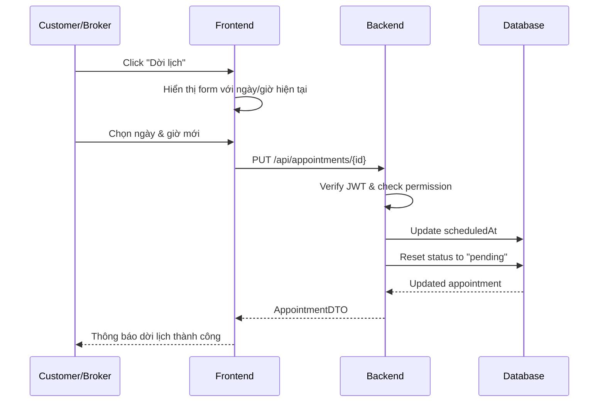
```mermaid
sequenceDiagram
    participant U as Customer/Broker
    participant F as Frontend
    participant B as Backend
    participant DB as Database

    U->>F: Click "Dời lịch"
    F->>F: Hiển thị form với ngày/giờ hiện tại
    U->>F: Chọn ngày & giờ mới
    F->>B: PUT /api/appointments/{id}
    B->>B: Verify JWT & check permission
    B->>DB: Update scheduledAt
    B->>DB: Reset status to "pending"
    DB-->>B: Updated appointment
    B-->>F: AppointmentDTO
    F-->>U: Thông báo dời lịch thành công
```

**Endpoint**: `PUT /api/appointments/{id}`

**Request Body**:
```json
{
  "scheduledAt": "2026-05-16T15:00:00",
  "note": "Khách hàng dời lịch"
}
```

**Quyền hạn**:
- Customer: Dời lịch hẹn của mình
- Broker: Dời lịch hẹn với khách hàng của mình
- Admin: Dời tất cả lịch hẹn

### 4. Hủy lịch hẹn

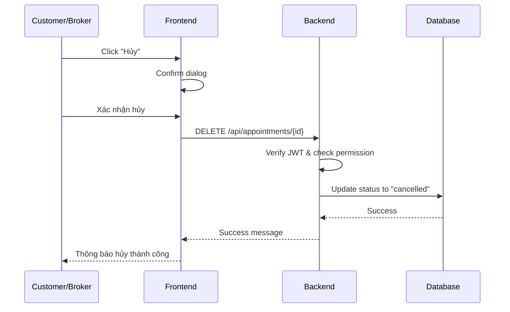
```mermaid
sequenceDiagram
    participant U as Customer/Broker
    participant F as Frontend
    participant B as Backend
    participant DB as Database

    U->>F: Click "Hủy"
    F->>F: Confirm dialog
    U->>F: Xác nhận hủy
    F->>B: DELETE /api/appointments/{id}
    B->>B: Verify JWT & check permission
    B->>DB: Update status to "cancelled"
    DB-->>B: Success
    B-->>F: Success message
    F-->>U: Thông báo hủy thành công
```

**Endpoint**: `DELETE /api/appointments/{id}`

**Lưu ý**: Hệ thống không xóa hẳn appointment, chỉ đổi status thành `cancelled`

### 5. Broker xác nhận/từ chối lịch hẹn

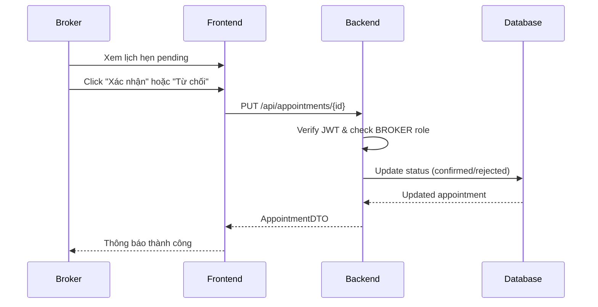
```mermaid
sequenceDiagram
    participant B as Broker
    participant F as Frontend
    participant BE as Backend
    participant DB as Database

    B->>F: Xem lịch hẹn pending
    B->>F: Click "Xác nhận" hoặc "Từ chối"
    F->>BE: PUT /api/appointments/{id}
    BE->>BE: Verify JWT & check BROKER role
    BE->>DB: Update status (confirmed/rejected)
    DB-->>BE: Updated appointment
    BE-->>F: AppointmentDTO
    F-->>B: Thông báo thành công
```

**Request Body**:
```json
{
  "status": "confirmed"
}
```

**Trạng thái lịch hẹn**:
- `pending`: Chờ xác nhận
- `confirmed`: Đã xác nhận
- `rejected`: Từ chối
- `cancelled`: Đã hủy
- `completed`: Đã hoàn thành

---

## Luồng quản lý giao dịch

### 1. Broker tạo giao dịch mới

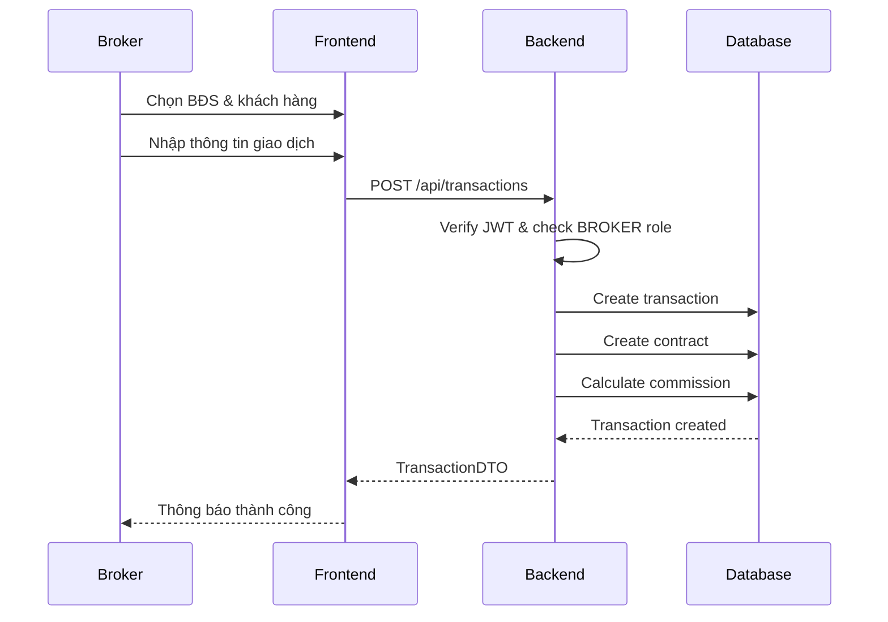
```mermaid
sequenceDiagram
    participant B as Broker
    participant F as Frontend
    participant BE as Backend
    participant DB as Database

    B->>F: Chọn BĐS & khách hàng
    B->>F: Nhập thông tin giao dịch
    F->>BE: POST /api/transactions
    BE->>BE: Verify JWT & check BROKER role
    BE->>DB: Create transaction
    BE->>DB: Create contract
    BE->>DB: Calculate commission
    DB-->>BE: Transaction created
    BE-->>F: TransactionDTO
    F-->>B: Thông báo thành công
```

**Endpoint**: `POST /api/transactions` (Cần implement)

**Request Body**:
```json
{
  "propertyId": 1,
  "customerId": 5,
  "transactionType": "sale",
  "totalAmount": 5000000000,
  "depositAmount": 500000000,
  "note": "Giao dịch mua bán"
}
```

**Quy trình**:
1. Tạo transaction với status `pending`
2. Tự động tạo contract liên kết
3. Tính commission cho broker (theo % cấu hình)
4. Cập nhật trạng thái BĐS nếu giao dịch hoàn tất

### 2. Theo dõi thanh toán

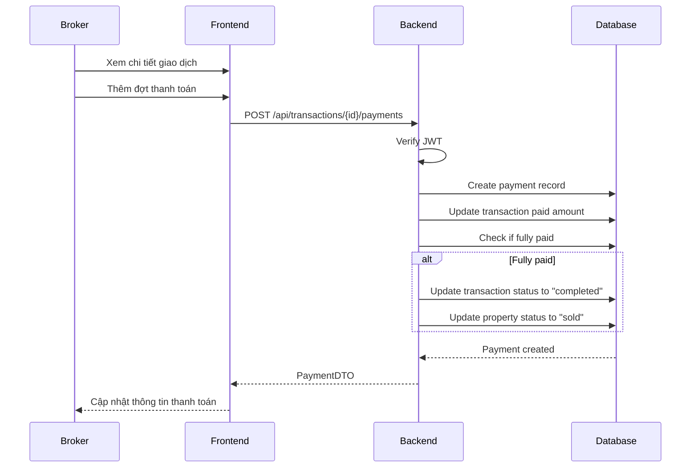
```mermaid
sequenceDiagram
    participant B as Broker
    participant F as Frontend
    participant BE as Backend
    participant DB as Database

    B->>F: Xem chi tiết giao dịch
    B->>F: Thêm đợt thanh toán
    F->>BE: POST /api/transactions/{id}/payments
    BE->>BE: Verify JWT
    BE->>DB: Create payment record
    BE->>DB: Update transaction paid amount
    BE->>DB: Check if fully paid
    alt Fully paid
        BE->>DB: Update transaction status to "completed"
        BE->>DB: Update property status to "sold"
    end
    DB-->>BE: Payment created
    BE-->>F: PaymentDTO
    F-->>B: Cập nhật thông tin thanh toán
```

**Endpoint**: `POST /api/transactions/{id}/payments` (Cần implement)

**Request Body**:
```json
{
  "amount": 1000000000,
  "paymentMethod": "bank_transfer",
  "note": "Đợt thanh toán 1"
}
```

---

## Luồng quản lý khách hàng tiềm năng (Lead)

### 1. Tạo lead từ inquiry

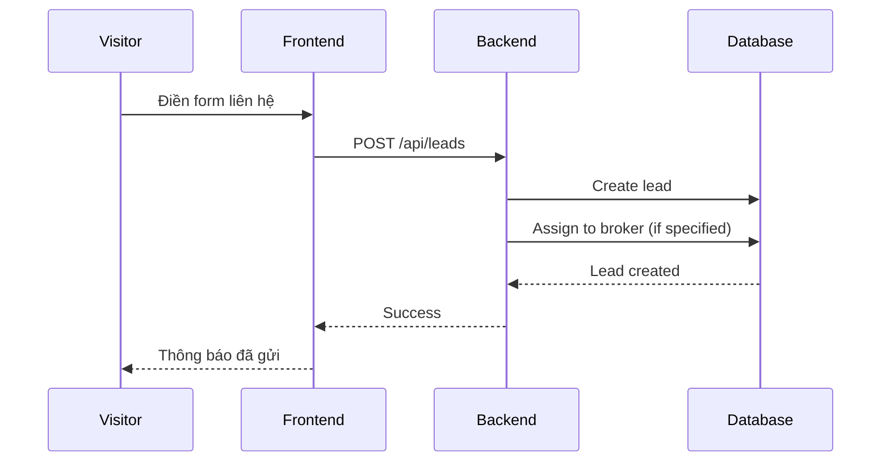
```mermaid
sequenceDiagram
    participant V as Visitor
    participant F as Frontend
    participant BE as Backend
    participant DB as Database

    V->>F: Điền form liên hệ
    F->>BE: POST /api/leads
    BE->>DB: Create lead
    BE->>DB: Assign to broker (if specified)
    DB-->>BE: Lead created
    BE-->>F: Success
    F-->>V: Thông báo đã gửi
```

**Endpoint**: `POST /api/leads` (Cần implement)

**Request Body**:
```json
{
  "fullName": "Nguyễn Văn C",
  "phone": "0987654321",
  "email": "customer@example.com",
  "propertyId": 1,
  "message": "Tôi quan tâm đến BĐS này",
  "source": "website"
}
```

### 2. Broker quản lý lead

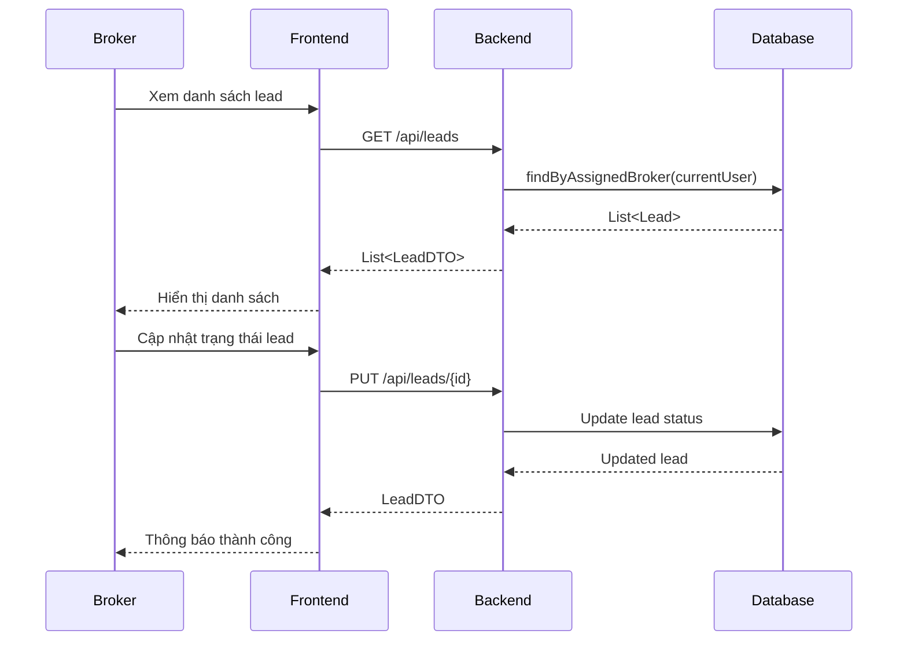
```mermaid
sequenceDiagram
    participant B as Broker
    participant F as Frontend
    participant BE as Backend
    participant DB as Database

    B->>F: Xem danh sách lead
    F->>BE: GET /api/leads
    BE->>DB: findByAssignedBroker(currentUser)
    DB-->>BE: List<Lead>
    BE-->>F: List<LeadDTO>
    F-->>B: Hiển thị danh sách

    B->>F: Cập nhật trạng thái lead
    F->>BE: PUT /api/leads/{id}
    BE->>DB: Update lead status
    DB-->>BE: Updated lead
    BE-->>F: LeadDTO
    F-->>B: Thông báo thành công
```

**Trạng thái lead**:
- `new`: Mới
- `contacted`: Đã liên hệ
- `qualified`: Đủ điều kiện
- `converted`: Đã chuyển đổi (thành customer)
- `lost`: Mất khách

---

## Tóm tắt API Endpoints

### Authentication
- `POST /api/auth/register` - Đăng ký
- `POST /api/auth/login` - Đăng nhập
- `POST /api/auth/logout` - Đăng xuất

### Properties
- `GET /api/properties` - Danh sách BĐS (Public)
- `GET /api/properties/{id}` - Chi tiết BĐS (Public)
- `POST /api/properties` - Tạo BĐS (Admin/Broker)
- `PUT /api/properties/{id}` - Cập nhật BĐS (Admin/Broker)
- `DELETE /api/properties/{id}` - Xóa BĐS (Admin)
- `PATCH /api/properties/{id}/status` - Cập nhật trạng thái (Admin)

### Appointments
- `GET /api/appointments` - Danh sách lịch hẹn (Authenticated)
- `POST /api/appointments` - Đặt lịch hẹn (Customer)
- `PUT /api/appointments/{id}` - Cập nhật lịch hẹn (Customer/Broker)
- `DELETE /api/appointments/{id}` - Hủy lịch hẹn (Customer/Broker)

### Transactions (Cần implement)
- `GET /api/transactions` - Danh sách giao dịch
- `POST /api/transactions` - Tạo giao dịch
- `PUT /api/transactions/{id}` - Cập nhật giao dịch
- `POST /api/transactions/{id}/payments` - Thêm thanh toán

### Leads (Cần implement)
- `GET /api/leads` - Danh sách lead
- `POST /api/leads` - Tạo lead
- `PUT /api/leads/{id}` - Cập nhật lead

---

## Bảo mật và Authorization

### JWT Token Flow
```
1. User login → Backend tạo JWT token
2. Frontend lưu token vào localStorage
3. Mọi request sau đó gửi kèm: Authorization: Bearer {token}
4. Backend verify token và extract user info
5. Check quyền hạn theo role
```

### Role-based Access Control

| Endpoint | Public | Customer | Broker | Admin |
|----------|--------|----------|--------|-------|
| GET /api/properties | ✅ | ✅ | ✅ | ✅ |
| POST /api/properties | ❌ | ❌ | ✅ | ✅ |
| PUT /api/properties/{id} | ❌ | ❌ | ✅* | ✅ |
| DELETE /api/properties/{id} | ❌ | ❌ | ❌ | ✅ |
| POST /api/appointments | ❌ | ✅ | ❌ | ✅ |
| PUT /api/appointments/{id} | ❌ | ✅* | ✅* | ✅ |

*: Có điều kiện (chỉ được sửa của mình)

---

## Xử lý lỗi

### Error Response Format
```json
{
  "success": false,
  "message": "Thông báo lỗi chi tiết",
  "data": null
}
```

### HTTP Status Codes
- `200 OK`: Thành công
- `201 Created`: Tạo mới thành công
- `400 Bad Request`: Dữ liệu không hợp lệ
- `401 Unauthorized`: Chưa đăng nhập
- `403 Forbidden`: Không có quyền
- `404 Not Found`: Không tìm thấy
- `500 Internal Server Error`: Lỗi server

---

## Ghi chú kỹ thuật

### Frontend
- **Framework**: React 18 + Vite
- **Routing**: React Router v6
- **State Management**: Context API
- **HTTP Client**: Axios
- **UI**: Tailwind CSS + Lucide Icons

### Backend
- **Framework**: Spring Boot 3.x
- **Security**: Spring Security + JWT
- **Database**: PostgreSQL
- **ORM**: Spring Data JPA
- **Validation**: Jakarta Validation

### Database Schema
- Xem file: `backend/sql/index.sql`
- Sample data: `backend/sql/sample_data.sql`

---

**Cập nhật lần cuối**: 11/05/2026
